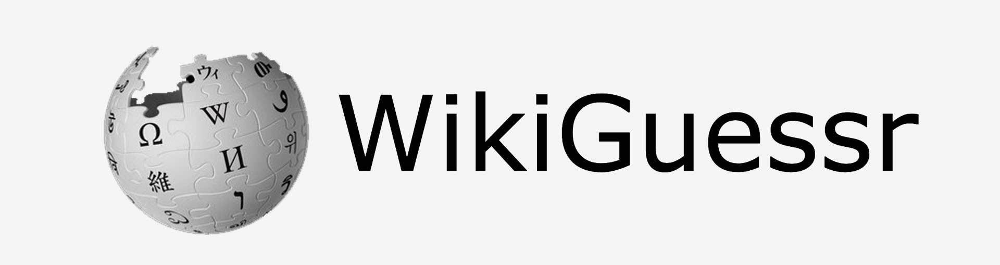

<h1 align="center">Wikiguessr</h1>

  <a href="#technologies">Technologies</a> •
  <a href="#how-to-play">How to Play</a> •
  <a href="#key-features">Key Features</a> •
  <a href="#project-design-and-organization">Project Design and Organization</a> 

A Wikipedia-based trivia game: try to guess words based on their Wikipedia article. 

 Play the game <a href="https://wikiguessr.com">here</a>! 

 This was my first CS project, and the code/organization is horrendous. Please don't judge too hard! 

## Technologies
- HTML
- CSS
- Javascript
- JQuery

## How To Play
Choose one of the ten preset categories to get appropriately themed words, or pick random to learn about some super obscure people you've never heard of and never will!

Each round, you start with the first paragraph of the intro section. You get three additional hints—each hint unlocks an additional section or subsection of the article. Just click on the one you want in the table of contents.

Type your guess in the top bar. All non-alphabetical characters are given to you, and the guess checker isn't case sensitive. Whether your answer is right or wrong, the full Wikipedia article will load, in case you want to read more about whatever intriguing subject you were on. 

Bewarned: the preset categories are mostly safe, but if you're playing on random, certain articles can cause Wikiguessr to freeze. If an article is loading for more than 10s, give the page a quick refresh.  

## Key Features
- Selects articles randomly
- Replaces title words in the article body
- Loads additional article sections/subsections with the table of contents
- Displays full article upon guess

## Project Design and Organization

This whole thing runs on boatloads of Javascript. The front-end sends a fetch request to a server for an article blueprint (a formulaic layout/map of the chosen Wikipedia article). That server pulls data from a MongoDB database (if you're playing a category) or the MediaWiki API (if you're on random), formats it nicely in an article blueprint, and hands it over to the front-end. Then, we replace the words in the article title with blanks and initialize the page with words and buttons. When an enter is detected, the input in the top bar is submitted and checked. The correct answer is displayed if wrong and the full article is loaded using lots of Javascript and JQuery. If another enter is detected, the game resets and the next word is chosen.

Originally, the static website was hosted with Google Cloud Bucket, the backend server with Google App Engine, and the database with MongoDB Atlas. As of Sep 2020, I've transferred everything over to Firebase (Hosting and Functions). The `server` folder is now an artifact, and the real server code is in `functions`, but it's mostly the same. 

Looking back, I don't think I'd yet learned the concept of organizing code into folders. Everything's just out there, floating around. The .jsons in the top level aren't actually used for anything; their information is stored in the MongoDB database. But though things might not be pretty, it should still work!

## Bugs

Sadly there might be a couple of these. If you find one, let me know!
